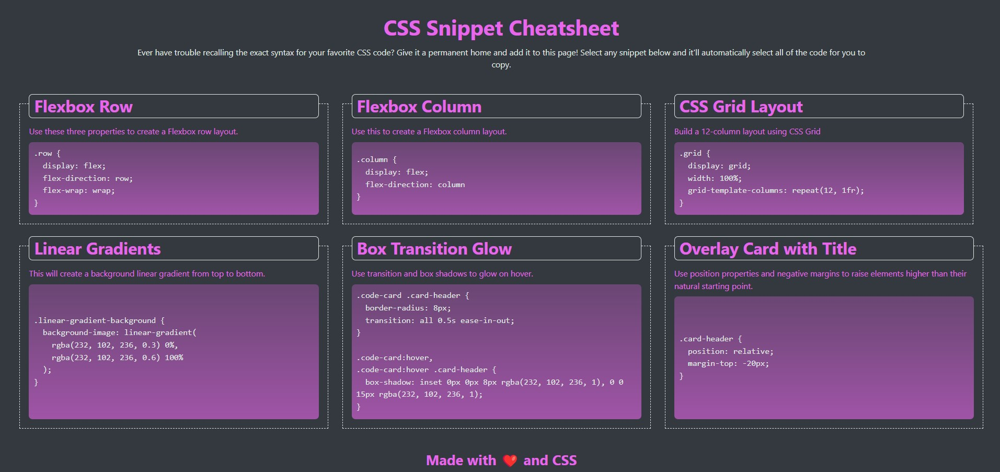

# CSS Snippet Cheat Sheet

A webpage that hosts a collection of CSS snippets. This will serve as both a learning tool and a reference for future CSS work.

## Table of Contents

- [Usage](#usage)
- [Mock Up](#mock-up)
- [Instructions](#instructions)
- [Key Features](#key-features)
- [Technology Stack](#technology-stack)
- [Additional Resources](#additional-resources)

## Usage

Open the `index.html` file in a browser to view the CSS snippets.

## Mock-Up

The following image shows the web application's appearance and functionality:

## Instructions

The application should meet the following criteria:

1. Create a grid layout to display CSS snippets using Flexbox and media queries.

2. Use CSS variables to maintain a clean, consistent color scheme.

3. Implement clickable code snippets that are highlighted on selection.

4. Make the layout responsive across devices, adjusting for mobile, tablet, and desktop views.

5. Include CSS features such as linear gradients and transitions for background effects and animations.

## Key Features

* Responsive grid layout with Flexbox and media queries.

* Clickable CSS snippets that can be easily highlighted.

* Background effects using CSS linear gradients.

* Animations using CSS transitions.

* Clean and reusable color scheme with CSS variables.

## Technology Stack

This application uses the following tools and technologies:

* **HTML:** Semantic structure with `<pre>` elements for code snippets.

* **CSS:** Flexbox for layout, media queries for responsiveness, and CSS variables for theming.

## Additional Resources

* Learn more about Flexbox: [CSS-Tricks Flexbox Guide](https://css-tricks.com/snippets/css/a-guide-to-flexbox/)

* Learn more about CSS media queries: [MDN Media Queries](https://developer.mozilla.org/en-US/docs/Web/CSS/Media_Queries)

* Learn about CSS transitions: [MDN CSS Transitions](https://developer.mozilla.org/en-US/docs/Web/CSS/transition)

* Learn about CSS linear gradients: [MDN CSS Linear Gradients](https://developer.mozilla.org/en-US/docs/Web/CSS/linear-gradient)

* Considerations for styling the `<pre>` tag: [CSS-Tricks Styling](https://css-tricks.com/considerations-styling-pre-tag/)
